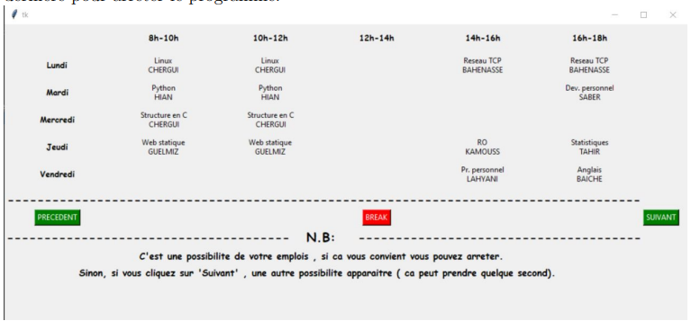

# Génération des emplois de temps

## Overview

Le problème d’emploi du temps peut être vu comme une instance des problèmes d’ordonnancement des tâches. Ce type consiste à distribuer des ressources sur des tâches selon un ordre adéquat et donc dans un temps approprié, tout en satisfaisant un ensemble de contraintes concernant les différentes parties constituant le problème. La construction d’emploi du temps universitaire consiste à organiser des rencontres entre les enseignants et les étudiants dans des salles de différentes catégories et durant des périodes hebdomadairement fixes.

Dans ce travail, nous nous intéressons à la résolution du problème d’emploi du temps universitaire. Pour ce fait, nous proposons un algorithme qui trouve les différentes possibilités d’emploi du temps en respectant les contraintes.

## Main Features

### For University Administrators

**Primary Users**: Administrators who manage and generate university timetables.

**Actions**:
- Input data regarding teachers, students, rooms, and periods
- Generate possible timetables respecting all constraints
- Modify and optimize generated timetables

## Features

- **Data Input**: Easy input of data regarding teachers, students, rooms, and periods.
- **Constraint Management**: Advanced handling of various constraints such as room capacities, teacher availability, and student groupings.
- **Timetable Generation**: Efficient algorithms to generate optimal timetables that meet all constraints.
- **Conflict Resolution**: Tools to detect and resolve scheduling conflicts.
- **User-Friendly Interface**: Intuitive interfaces for administrators, teachers, and students.

## Usage

1. **For University Administrators**:
   - Input all necessary data (teachers, students, rooms, periods) into the system.
   - Run the timetable generation algorithm.
   - Review and modify the generated timetables as needed.

